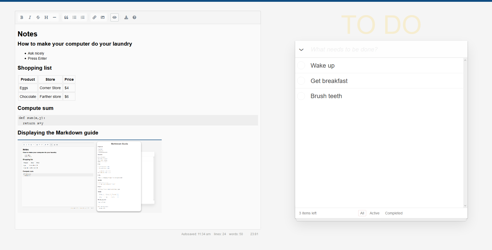

# Notes and ToDo page

Web page to take quick notes and keep a todo list.
The notes and todo are saved in the browser's `localStorage`.
The notes can be saved to a text file.

I blended this together from [SimpleMDE](https://github.com/sparksuite/simplemde-markdown-editor) and this [ToDo list](https://github.com/dwyl/javascript-todo-list-tutorial)
for my own use. 

One can also type in equations. It uses [MathJax](https://www.mathjax.org/) for this.

## How to use:

 * Clone the repo `git@github.com:franklinvp/notes_todo_page.git` and open the page `home.html` that is in it in some browser.
 * Click the button with the eye to toggle between edit or view modes of the notes. The notes can be typed in Markdown language.
 * The button with the question mark displays a cheat sheet of the Markdown language that can be used to format the notes nicely.
 * The button with the down arrow saves the notes as a text file.
 * Type and Enter at the top of the TODO section to add items to the TODO list.

## Screenshot

